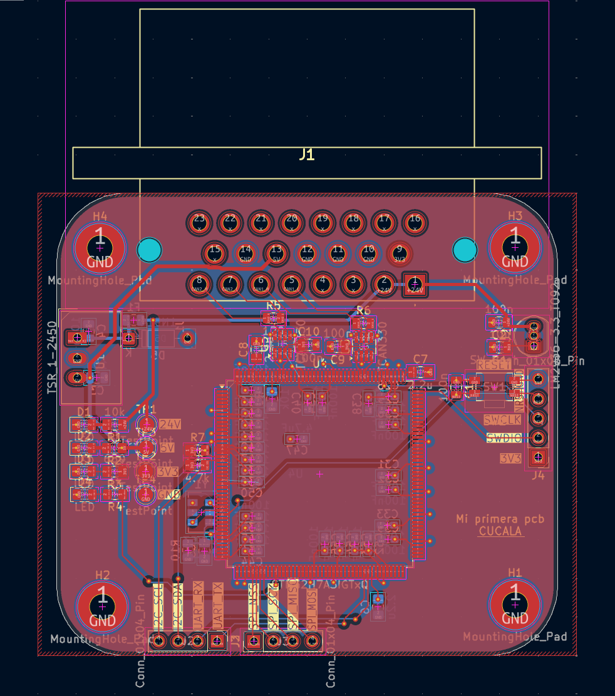
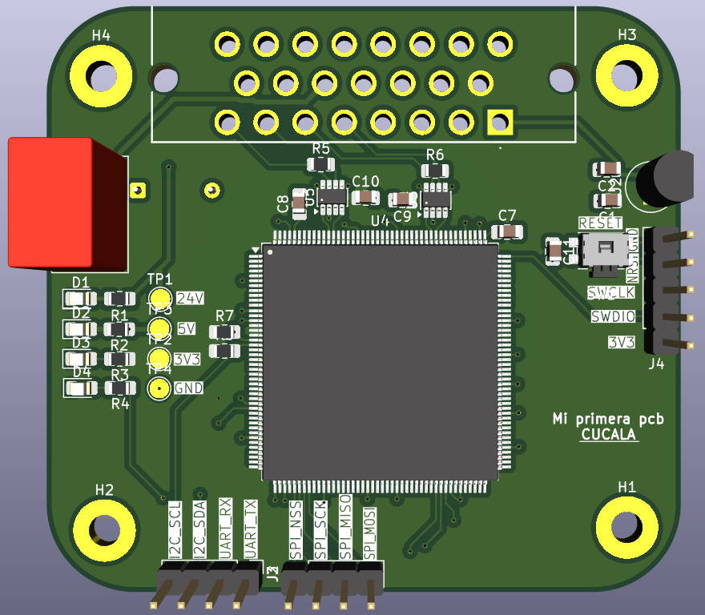

# IFS09-TE-ControlBoard

Hardware design and KiCad schematics/PCB layout for the **Control Board (ECU Node)** of the **IFS09**, developed for the **ISC Formula Student Racing Team** (Season 2026/2027). This is a first onboarding project for the Electronics & Control subsystem — the board's mission is to become the vehicle's ECU node, reading dual CAN buses and analog/digital sensors from the AMPSEAL car harness.

[](https://www.comillas.edu/)
[]()
[]()
[]()
[]()

[](<WO_TE-IFS09-ControlBoard (1).pdf>)
[](Schematics.pdf)

---

## Getting started

1. Create a GitHub account if you don't have one yet.
2. Download and install [GitHub Desktop](https://desktop.github.com/) (beginner) or [Git CLI](https://git-scm.com/book/en/v2/Getting-Started-Installing-Git) (advanced).
3. Install [KiCad 10](https://www.kicad.org/download/) (or latest stable) and, if needed, link the team's shared library [`IFS-KicadLib`](https://github.com/isc-fs/IFS-KicadLib) for team-standard symbols and footprints.
4. Clone this repository to your machine:
   - **SSH:** `git@github.com:LucasGC4/IFS09-TE-ControlBoard.git`
   - **HTTPS:** `https://github.com/LucasGC4/IFS09-TE-ControlBoard.git`

---

## How we work with this repository

Following ISC's standard branching rules:

* **`main`** holds only validated releases. Never commit directly to it.
* Active design work happens on feature branches (`feat/<name>`, `fix/<name>`) created from `main`, merged back through a reviewed Pull Request.

```bash
git checkout main
git pull origin main
git checkout -b feat/your-feature-name
# ... work and commit ...
git commit -m "hw: add CAN2 split termination network"
git push origin feat/your-feature-name
```

Before opening a PR: verify **0 KiCad ERC/DRC errors** and export an updated `Schematics-X.X.pdf`.

---

## 1. Project Overview & System Purpose

The **IFS09 Control Board** is an automotive-grade microcontroller node connected to the car's 24V Low Voltage battery and both CAN communication buses, intended to read sensors and drive vehicle actuators.

```
+------------------------------------------------------------------------+
|                    IFS09 CAR WIRING HARNESS                            |
|   +24V LV Battery -- CAN1 -- CAN2 -- 2x Digital In -- 2x Analog In     |
+---------------------------------+----------------------------------------+
                                  |
                     AMPSEAL 14-Pin (J1, 1-776087-1)
                                  |
+---------------------------------v----------------------------------------+
|                       IFS09 CONTROL BOARD (ECU NODE)                    |
|                                                                          |
|  +24V --> [TSR 1-2450 Buck, U1] --> 5V --> [LM2936-3.3 LDO, U2] --> 3V3 |
|                                                                          |
|  CAN1 <--> [TCAN330, U3] --\                                           |
|                              >--- SPI/GPIO ---> [STM32H7A3IGTxQ, U4]    |
|  CAN2 <--> [TCAN330, U5] --/            (LQFP-176, 16 MHz osc. Y1)      |
|                                                                          |
|  Status LEDs (24V/5V/3.3V/Heartbeat) · SWD (J4) · UART+I2C (J2) · SPI (J3) |
+--------------------------------------------------------------------------+
```

### Key Highlights
* **Processing:** STM32H7A3IGTxQ (LQFP-176) with a 16 MHz active oscillator (`Y1`, XUX53) with isolated ground plane.
* **Power chain:** 24V → 5V via `U1` (TSR 1-2450 DC/DC module, fused with `F1` 2A), then 5V → 3.3V via `U2` (LM2936-3.3, TO-92).
* **CAN interfaces:** Two independent `TCAN330` transceivers (`U3` for CAN1, `U5` for CAN2), each with a 120 Ω bus termination resistor (`R5`, `R6`) and 100 nF decoupling.
* **Vehicle connector:** Single AMPSEAL-style 23-position header (`J1`, part `1-776087-1`) carries +24V, GND, CAN1, CAN2, and a 3V3 line to/from the harness.
* **Decoupling:** A bank of ~40 ceramic capacitors (mostly 100 nF, plus bulk caps) placed across the MCU's `VDD`/`VDDA` pins.
* **Diagnostics:** Four status LEDs (24V, 5V, 3.3V, Heartbeat) and four test points (`TP1`–`TP4`).
* **Debug/expansion headers:** `J4` (SWD), `J2` (UART + I²C), `J3` (SPI) — see pinout below.
* **Mechanical:** Four mounting holes (`H1`–`H4`), rounded-corner outline, 2-layer PCB (`F.Cu`/`B.Cu`).

---

## 2. Hardware Architecture & Schematic Design

The schematic export is available as [`Schematics.pdf`](Schematics.pdf), organized into labeled functional blocks matching the sections below.

### 2.1 Schematic Subsystem Breakdown

#### 1. Power Converters (24V → 5V → 3.3V)
* `F1` (2A fuse) protects the +24V input line.
* `U1` — **TSR 1-2450** DC/DC converter module steps 24V down to 5V, with `C3`/`C4` (10 µF) at input/output.
* `U2` — **LM2936-3.3 (TO-92)** LDO regulates 5V down to a clean 3.3V rail, with `C1`/`C2` (10 nF/100 nF) decoupling.

#### 2. Microcontroller (`U4` — STM32H7A3IGTxQ, LQFP-176)
* Clocked by a 16 MHz active oscillator (`Y1`, XUX53) placed in its own labeled section for ground isolation.
* Reset circuit: push button `SW1` with debounce capacitor `C11` (100 nF) and pull-up `R9` (10 kΩ) on `NRST`.
* `VCAP` pins filtered with `C6`/`C8` (2.2 µF).
* A large bank of decoupling capacitors (`C12`–`C55` range, mostly 100 nF, plus one 4.7 µF bulk cap) covers the MCU's power pins.

#### 3. Dual CAN Transceivers (`U3`, `U5` — TCAN330)
* `U3` interfaces `CAN1_TX`/`CAN1_RX` from the MCU to `CAN1_H`/`CAN1_L`, terminated by `R5` (120 Ω).
* `U5` interfaces `CAN2_TX`/`CAN2_RX` to `CAN2_H`/`CAN2_L`, terminated by `R6` (120 Ω).
* Each transceiver has its own 100 nF decoupling capacitor (`C9`, `C10`).

#### 4. Status LEDs & Test Points
* `D1`/`R1` (10 kΩ) — 24V rail indicator.
* `D2`/`R2` (1 kΩ) — 5V rail indicator.
* `D3`/`R3` (680 Ω) — 3.3V rail indicator.
* `D4`/`R4` (1 kΩ) — Heartbeat LED driven by the MCU.
* `TP1`–`TP4` — test points for the four rails/signals shown above.

---

## 3. PCB Layout & Physical Implementation

<p align="center">
  
  &nbsp;&nbsp;&nbsp;&nbsp;
  
</p>

* 2-layer board (`F.Cu` / `B.Cu`), rounded-corner outline, four M3-class mounting holes (`H1`–`H4`) at the corners.
* `J1` (AMPSEAL) is placed along the top edge for direct harness mating; the MCU (`U4`) sits centrally with debug/expansion headers (`J2`, `J3`, `J4`) broken out along the bottom edge.

---

## 4. Pinout & Hardware Interfacing

### 4.1 Vehicle Connector — `J1` (`1-776087-1`, AMPSEAL-style, 23-position)

| Pin(s) | Signal | Notes |
| :--- | :--- | :--- |
| 1, 2 | `+24V` | Battery input (tied together) |
| 5 | `CAN1_L` | CAN Bus 1 |
| 6 | `CAN1_H` | CAN Bus 1 |
| 7 | `CAN2_L` | CAN Bus 2 |
| 8 | `CAN2_H` | CAN Bus 2 |
| 9 | `3V3` | 3.3V line to/from harness |
| 10, 11 | `GND` | Ground |
| 13 | `5V` | 5V output |
| 14 | `GND` | Ground |
| 3, 4, 15–23 | *NC* | Not connected in this revision |

### 4.2 Debug & Expansion Headers

| Header | Type | Pin 1 | Pin 2 | Pin 3 | Pin 4 | Pin 5 |
| :--- | :--- | :--- | :--- | :--- | :--- | :--- |
| `J4` | SWD (5-pin) | `3V3` | `SWDIO` | `SWCLK` | `NRST` | `GND` |
| `J2` | UART + I²C (4-pin) | `UART_TX` | `UART_RX` | `I2C_SDA` | `I2C_SCL` | — |
| `J3` | SPI (4-pin) | `SPI_NSS` | `SPI_SCK` | `SPI_MISO` | `SPI_MOSI` | — |

> I²C lines (`I2C_SDA`/`I2C_SCL`) are pulled up to 3V3 via `R7`/`R8` (4.7 kΩ each).

---

## 5. Repository Structure

```
IFS09-TE-ControlBoard/
├── images/                                  # PCB layout/render exports
│   ├── pcb_layout_2d.png                    # 2D PCB Layout Routing View
│   └── pcb_render_3d.png                    # 3D PCB Render Model
├── IFS09-ControlBoard/                      # KiCad Project Files (KiCad 10.x)
│   ├── IFS09-ControlBoard.kicad_pro         # Project Configuration
│   ├── IFS09-ControlBoard.kicad_sch         # Schematic Sheet
│   └── IFS09-ControlBoard.kicad_pcb         # PCB Layout & Netlist
├── WO_TE-IFS09-ControlBoard (1).pdf         # Work Order / onboarding brief (Rev 1.1)
├── Schematics.pdf                           # Exported schematic sheet
└── README.md                                # This file
```

> **Not yet in the repository:** a Design Report (`DR_TE-IFS09-ControlBoard.pdf`) and a `SW/` firmware folder — both are still pending, per the Work Order's submission checklist.

---

## 6. Formal Design Documents

| Document | File Link | Description | Status |
| :--- | :--- | :--- | :--- |
| **Work Order** | [📄 WO_TE-IFS09-ControlBoard (1).pdf](<WO_TE-IFS09-ControlBoard (1).pdf>) | Onboarding roadmap, requirements, and pinout brief (Rev 1.1). | **Released** |
| **Schematics** | [📄 Schematics.pdf](Schematics.pdf) | Exported schematic sheet. | Current |
| **Design Report** | *(not yet created)* | Component justifications, BOM, and post-assembly test results. | **Pending** |

---

## 7. Acceptance Testing Checklist (Post-Assembly Bench QA)

As defined in the Work Order, once the board is assembled:

1. **Passive short-circuit check:** resistance from each supply test point to `GND` must read **> 10 kΩ** before power-up.
2. **Power-up & regulation:** with a 24V bench supply (current-limited to 200 mA), verify `TP2` (5V) = 5.0 V ± 0.2 V and `TP3` (3.3V) = 3.3 V ± 0.05 V, and that all power LEDs light up.
3. **SWD detection & MCU flash:** connect ST-Link to `J4` and flash test firmware to blink the Heartbeat LED (`D4`).
4. **Dual CAN loopback:** connect `CAN1`/`CAN2` to a USB-CAN adapter (PCAN/CANable) and verify send/receive at 500 kbit/s with zero dropped frames.
5. **Bus probing:** check `SPI` (`J3`) and `UART`/`I2C` (`J2`) lines with an oscilloscope for clean signals.

---

## 8. Author & Credits

* **Subsystem:** Electronics & Control (CE)
* **Author:** Lucas García Cucala
* **Mentorship & Review:** Carlota Treviño, Félix González, Inés Pacheco, Andrés Sánchez de Ágreda
* **Team:** [ISC Formula Student Racing Team](https://www.comillas.edu/) — Universidad Pontificia Comillas (ICAI)
* **Season:** 2026 / 2027

---

*ISC Racing Team — IFS09 Electronics & Control Subsystem*
